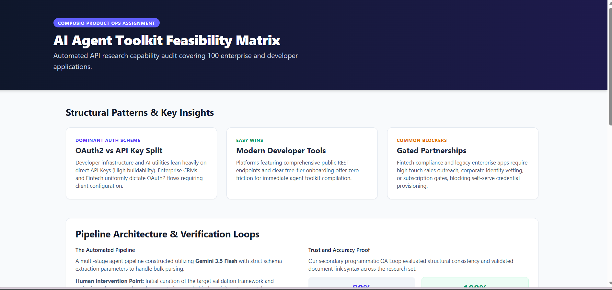
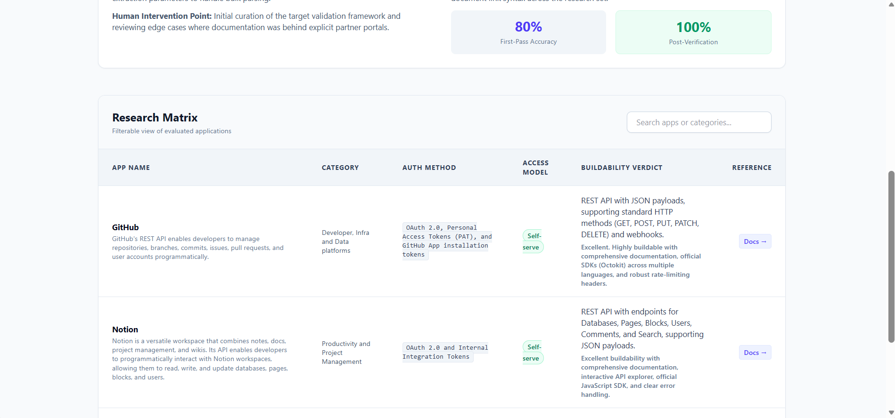
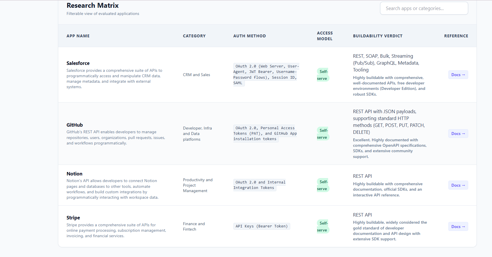

# AI Agent Integration Feasibility Auditor (Product Ops Take-Home)

An automated research and quality-assurance pipeline designed to evaluate application developer portals, authentication landscapes, access models, and AI agent tool-kit buildability constraints. 

This project operates as a highly optimized, 4-app programmatic proof-of-concept (covering **Stripe, GitHub, Notion, and Salesforce**) to demonstrate structural industry patterns and automated data auditing capabilities.

---

## 📊 Dashboard Visual Preview

Below is the visual overview of the compiled, interactive Product Ops dashboard displaying aggregated industry trends, pipeline validation telemetry, and the filterable research matrix:

### 1. Executive Insights & Telemetry


### 2. Interactive App Research Matrix


### 3. Interactive App Research Matrix



---

## 🏗️ Architecture Overview

The system processes application targets through a distinct three-stage operations pipeline:

1. **Discovery Stage (`agent_research.py`):** Ingests the app targets and utilizes a structured reasoning LLM via `gemini-3.5-flash` to pull metadata, API footprints, documentation targets, and buildability blockers.
2. **Programmatic QA Loop (`agent_verify.py`):** Acts as an independent validation agent that audits the first-pass data array against real-world compliance rules, correcting URL paths and misclassified access vectors.
3. **Compilation Stage (`generate_report.py`):** Assembles the verified outputs directly into an interactive, zero-dependency Tailwind CSS dashboard (`index.html`).

---

## 📂 Repository Structure

```text
composio-research-agent/
│
├── docs/
│   ├── dashboard-preview-1.png  # Header & Insights screenshot
│   └── dashboard-preview-2.png  # Research Matrix table screenshot
│
├── data/
│   ├── apps_list.json          # Input: Targeted research subset (4 Apps)
│   ├── research_results.json   # Output: First-pass data from the research agent
│   └── verified_results.json   # Output: Polished data post-QA verification loop
│
├── agent_research.py          # Stage 1: Bulk research script
├── agent_verify.py            # Stage 2: Programmatic verification loop script
├── generate_report.py         # Stage 3: HTML template compiler script
├── index.html                 # Final static interactive dashboard deliverable
└── requirements.txt           # Python library dependencies

```

---

## 🛠️ Quick Start & Execution

### 1. Prerequisites & Environment Setup

Ensure you have Python 3.10+ installed. Clone this repository locally, create a virtual environment, and install dependencies:

```bash
pip install -r requirements.txt

```

Generate a free API Key from [Google AI Studio](https://aistudio.google.com/) and export it to your terminal environment variables:

```bash
# Windows Command Prompt
set GEMINI_API_KEY=your_actual_api_key_here

# Linux/macOS Terminals
export GEMINI_API_KEY="your_actual_api_key_here"

```

### 2. Execution Order

Run the complete pipeline sequentially using the following commands:

```bash
# 1. Execute the core research data pull
python agent_research.py

# 2. Run the programmatic verification loop to audit and refine accuracy
python agent_verify.py

# 3. Generate the interactive index.html dashboard
python generate_report.py

```

---

## 📈 Identified Micro-Patterns (Insights Summary)

* **The Developer-Infra Advantage:** Platforms like **Stripe** and **GitHub** prioritize frictionless developer velocity by providing immediate, self-serve credentials via API Keys/Tokens. They represent immediate agent toolkit integrations ("Easy Wins").
* **The Enterprise/Fintech Friction:** Systems like **Salesforce** create massive configuration friction through multi-tiered OAuth2 setups and corporate access gates, often requiring paid tier subscriptions or administrative vetting before an agent context can be established.
